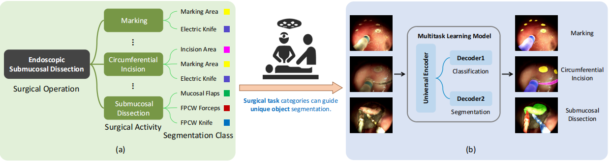

# EndoARSS:  Adapting Spatially-Aware Foundation Model for Efficient Activity Recognition and Semantic Segmentation in Endoscopic Surgery
Guankun Wang*, Rui Tang*, Mengya Xu*, Long Bai, Huxin Gao, and Hongliang Ren† <br/>

## Overview
Endoscopic surgery is the gold standard for robotic assisted minimally invasive surgery, offering significant advantages in early disease detection and precise interventions. However, the complexity of surgical scenes, characterized by high variability in different surgical activity scenarios and confused image features between targets and the background, presents challenges for surgical environment understanding. Traditional deep learning models often struggle with cross-activity interference, leading to suboptimal performance in each downstream task. To address this limitation, we explore multi-task learning which utilizes the interrelated features between tasks to enhance overall task performance. In this paper, we propose EndoARSS, a novel multi-task learning framework specifically designed for endoscopy surgery activity recognition and semantic segmentation. Built upon the DINOv2 foundation model, our approach integrates Low-Rank Adaptation to facilitate efficient fine-tuning while incorporating Task Efficient Shared Low-Rank Adapters (TESLA) to mitigate gradient conflicts across diverse tasks. Additionally, we introduce the Spatially-Aware Multi-Scale Attention that enhances feature representation discrimination by enabling cross-spatial learning of global information within complex surgical environments. In order to evaluate the effectiveness of our framework, we present three novel datasets, MTLESD, MTLEndovis and MTLEndovis-Gen, tailored for endoscopic surgery scenarios with detailed annotations for both activity recognition and semantic segmentation tasks. Extensive experiments demonstrate that EndoARSS achieves remarkable performance across multiple benchmarks, significantly improving both accuracy and robustness in comparison to existing models. These results underscore the potential of EndoARSS to advance AI-driven endoscopic surgical systems, offering valuable insights for enhancing surgical safety and efficiency.

<p align="center">
  
</p>

## Environment Setup (Linux)

### Clone this repository and navigate to the EndoARSS folder

```bash
git clone https://github.com/gkw0010/EndoARSS
cd EndoARSS/
```

### Install required packages

   ```bash
   conda create -n endoarss python=3.10 -y
   conda activate endoarss
   pip install -r requirements.txt
   ```

## Data Download
The MTLESD and MTLEndovis dataset can be downloaded through [this link](https://mycuhk-my.sharepoint.com/:f:/g/personal/1155180074_link_cuhk_edu_hk/EoFknACX2hNFueV5YYgeshEB_InOEnGcZAsnkqVOPktACQ?e=9R3Ssa).

## Checkpoint MTLESD and MTLEndovis
| Checkpoint Name | Link |
|------------------|------|
| MTLESD           | [MTLESD](https://mycuhk-my.sharepoint.com/:f:/g/personal/1155180074_link_cuhk_edu_hk/EnjQKAbjAetEhpZfQUNkCIUB5XkaCh-NuVquYtcL5KQ2tQ?e=v1adCV) |

## Train and eval

```bash
python ds_train.py
```

## Citation

If you find  [**EndoARSS**](https://arxiv.org/pdf/2506.06830) useful for your research or development, please cite the following:


```latex
@misc{wang2025endoarssadaptingspatiallyawarefoundation,
      title={EndoARSS: Adapting Spatially-Aware Foundation Model for Efficient Activity Recognition and Semantic Segmentation in Endoscopic Surgery}, 
      author={Guankun Wang and Rui Tang and Mengya Xu and Long Bai and Huxin Gao and Hongliang Ren},
      year={2025},
      eprint={2506.06830},
      archivePrefix={arXiv},
      primaryClass={cs.CV},
      url={https://arxiv.org/abs/2506.06830}, 
}

